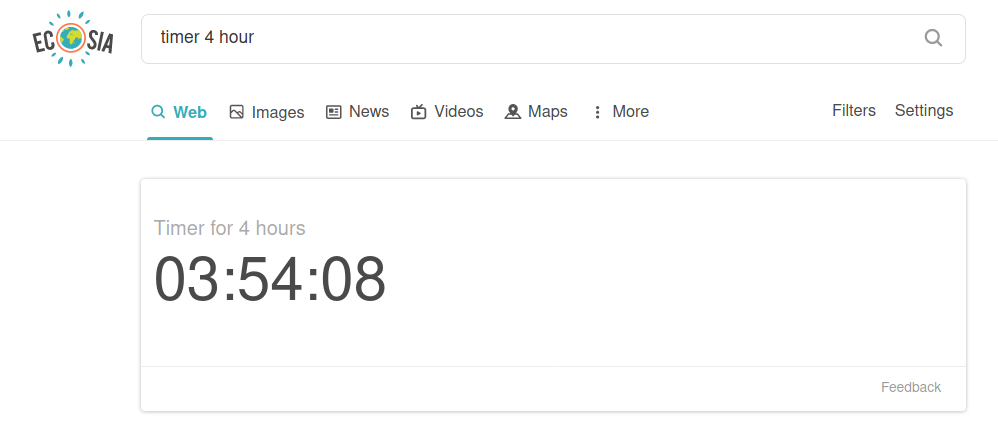
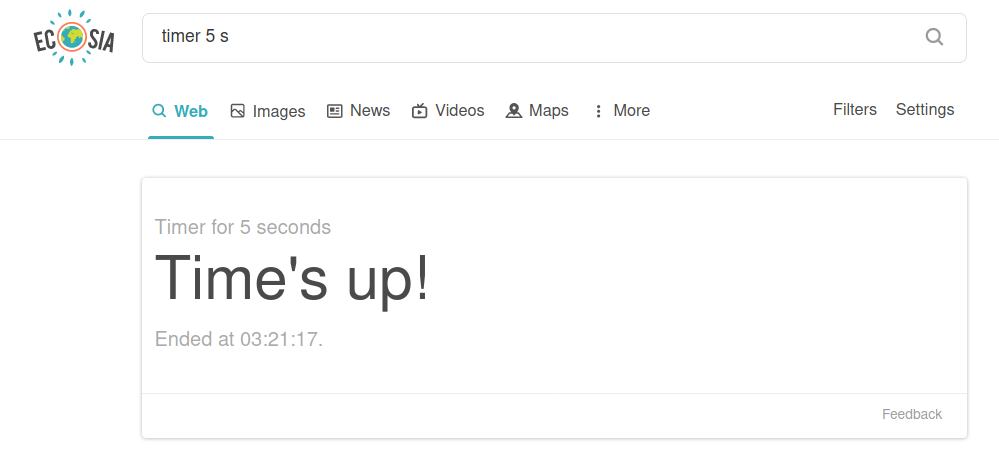

## ecosia-plugin-react
**An easy to use tool that makes planting trees even easier**

### About
This is an implementation of my [Ecosia extension tool](https://github.com/nbennett320/ecosia-widget-react). On first inspection - perhaps based on the title - you might think this adds a timer to Ecosia, similar to Google(🤢)'s [timer feature](https://www.google.com/search?q=timer)........ And you'd be correct!
The idea is that cool new features will help reel in new users to Ecosia, and new Ecosia users === more trees planted 🌳💞. 


### Syntax
```
# timer for 5 minutes
> timer 5 minutes/minute/mins/min/m
> timer minutes/minute/mins/min/m 5
> timer 5

# timer for 3 hours
> timer 3 hours/hour/hrs/hr/h
> timer hours/hour/hrs/hr/h 5

# timer for 1 second
> timer 1 seconds/second/secs/sec/s
> timer 1 seconds/second/secs/sec/s 1
```

### Installation
```
# clone the repo
$ git clone git@github.com:nbennett320/ecosia-timer.git

# change the active directory to the directory titled, "ecosia-timer", 
# which (in this example) was just downloaded from github
$ cd ecosia-timer/

# install dependencies with yarn
$ yarn install
```

### Usage
```
# open a development window in firefox 
$ yarn run start:firefox

# open a development window in (🤢) chrome 
$ yarn run start:chrome

# build files to './extension'
$ yarn run build

# compress build folder to {manifest.name}.zip and crx
$ npm run build
$ npm run compress -- [options]
```